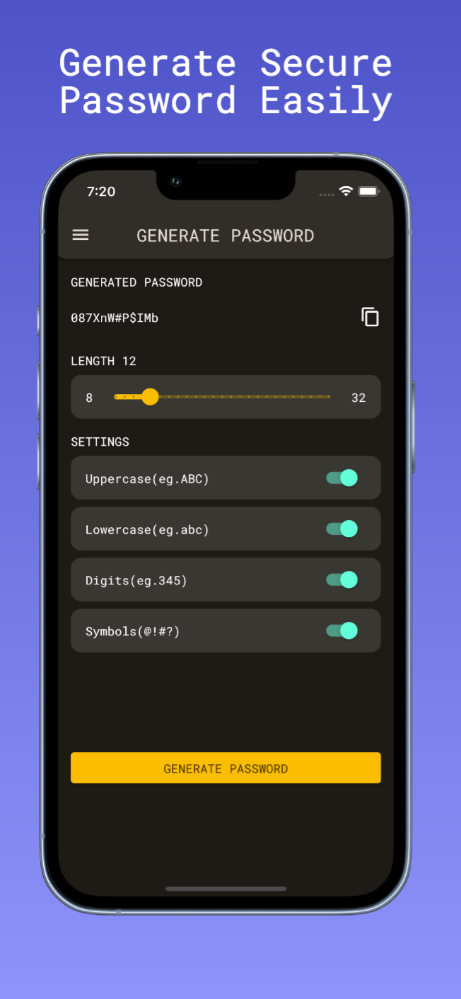
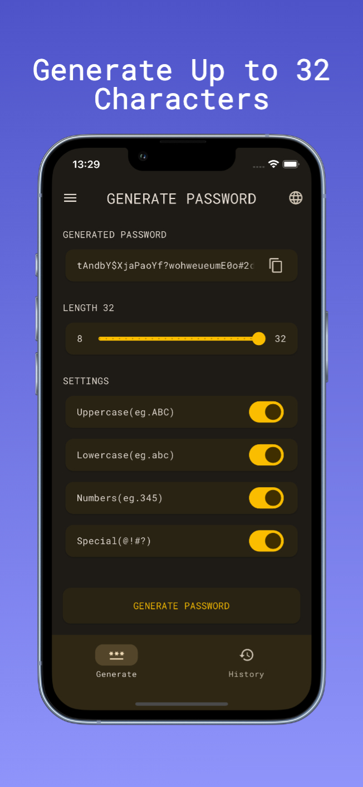
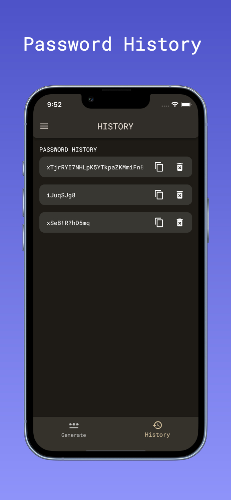
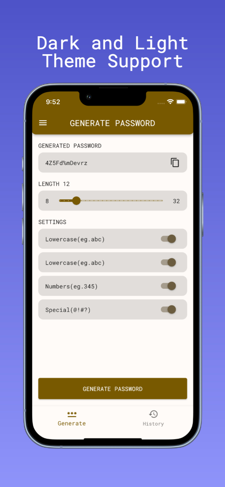
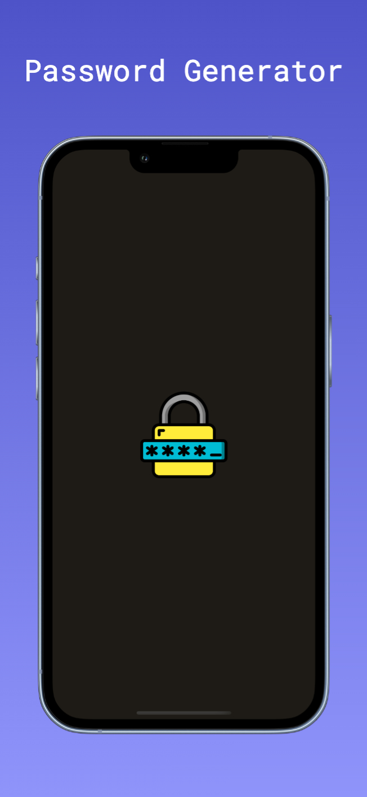

# Password Generator

Password Generator generates secure passwords of specified length and settings.

## Available on

## Built With

- [Flutter](https://flutter.dev/)
- [Dart](https://dart.dev/)

## Packages
- State Management
  - [Bloc](https://pub.dev/packages/flutter_bloc)
- Dart Data Class Generation
  - [Freezed](https://pub.dev/packages/freezed)
- Functional Programming
  - [Dartz](https://pub.dev/packages/dartz)
- Navigation
  - [AutoRoute](https://pub.dev/packages/auto_route)
- Caching
  - [HydratedBloc](https://pub.dev/packages/hydrated_bloc)

## Preview

    
    
    
    
    

## Contributing
### Translation
You can help translate this app to other languages!

1. Fork this repository
2. Choose one
    - Add missing translations in existing languages: Track `missing_translations.json` in [lib/app/l10n/arb][l10n]
   - Improve translations in existing languages: Update `<locale>.arb` in [lib/app/l10n/arb][l10n]
   - Add new languages: Create a new `<locale>.arb` file in [lib/app/l10n/arb][l10n]; see also: [locale codes][locale codes].
3. Run the app
   1. Make sure you have this app once via `flutter run`.
4. Open a pull request

[l10n]: https://github.com/cem256/password_generator/tree/master/lib/app/l10n/arb
[locale codes]: https://saimana.com/list-of-country-locale-code/

## Privacy Policy

You can access the privacy policy by clicking [here](privacy-policy.md).

